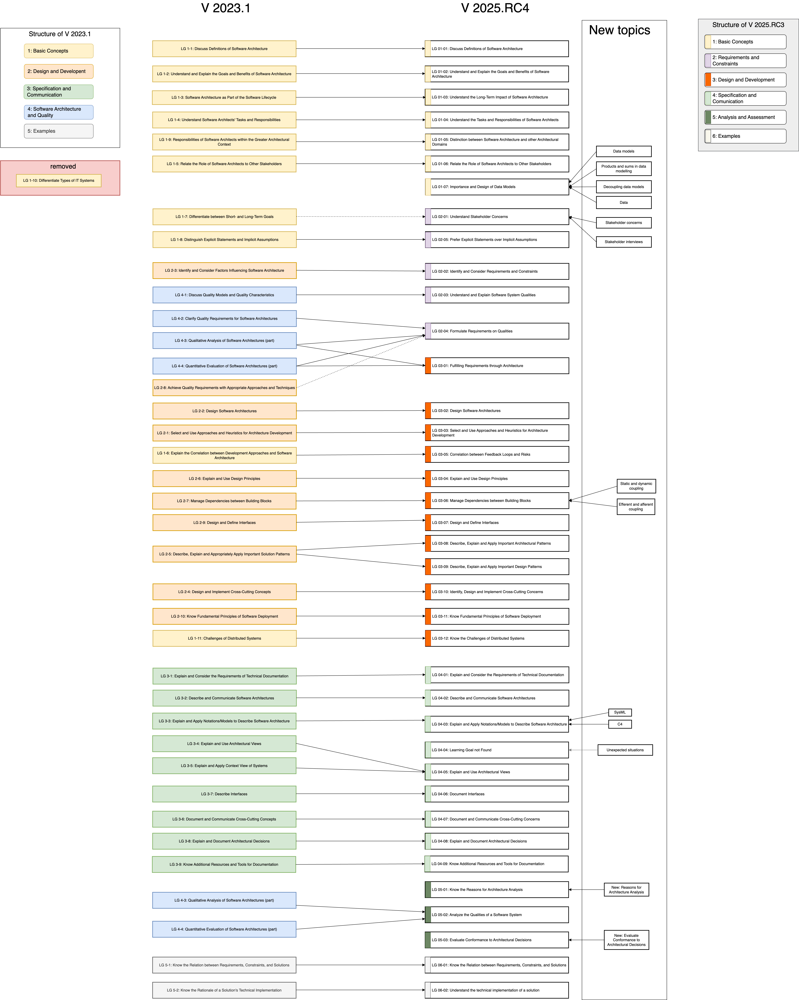

## Table of Contents
- [Changes in 2025.1](#changes-in-20251)
  - [Very Short Summary](#very-short-summary)
  - [Summary](#summary)
  - [Detailed Change History](#detailed-change-history)

>#### Abbreviations used below:
>
> * LG: Learning goal
> * LGI: Learning goal item (_bullet item_ within LG)
> * RC: Release candidate
  

# Changes in 2025.1

The baseline for the following comparison is the latest release of 2023.1

The list of fixed/resolved issues can be found in the [Kanban board](https://github.com/orgs/isaqb-org/projects/7/views/1) on GitHub.
For 2025.1, we have resolved more than 60 issues, comments and problems in both the English (EN) and German (DE) version.

## Very Short Summary

* The structure of the curriculum has been aligned with the architectural tasks (clarify requirements, design the system, communicate, evaluate/analyze)
* As a consequence, many learning goals have been moved.
* Examination-relevant content largely remained unchanged.
* Many LGs got new numbers, but the old numbers are kept in the title to facilitate migration.   

## Summary

The new version is structured along the fundamental activities and responsibilities of software architecture as a role, preceeded by some basic concepts:

| Section | Content |
|:----|-------|
| 1| Basic concepts |
| 2 | Clarifying stakeholder requirements and constraints|
| 3|  Designing and developing software architectures, taking structural and conceptual decisions|
| 4|  Communicating and documenting the architecture for various stakeholders|
| 5|  Analyzing and assessing software architectures|
| 6| Examples of software architectures |

####  The following topics have been removed:

* Software Lifecycle
* Differentiate types of IT systems
* Expect-errors principle
* SOLID principles (except Open/Closed and Dependency-Inversion)

#### The following topics are new in V2025:

* Data models
* Stakeholder concerns + -interviews
* Static and dynamic coupling
* Efferent and afferent coupling
* SysML, C4
* Deal with unexpected situations
* Reasons for architecture analysis
* Evaluate conformance to architectural decisions

The mapping of V2023 to V2025 is provided in graphical format for your convenience:

## Detailed Change History

In case you are curious, take a look at the [change history](https://github.com/isaqb-org/curriculum-foundation/activity). 
Work relevant for 2025.1 has begun October 2023, and is documented by detailed commits to the repository.

>Count commits across all branches:
>`git rev-list --all --count --since="23 October 2023"`

