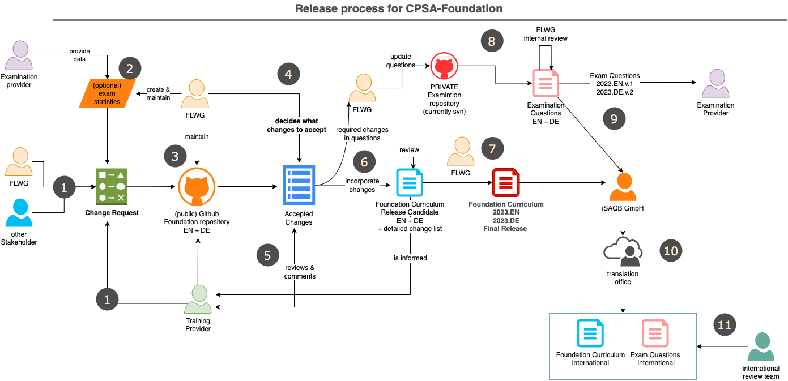

= https://isaqb.org[iSAQB] Foundation Level Curriculum
:toc:
:toc-placement!:

ifdef::env-github[]
:tip-caption: :bulb:
:note-caption: :information_source:
:important-caption: :heavy_exclamation_mark:
:caution-caption: :fire:
:warning-caption: :warning:
endif::[]

== Status

image:https://github.com/isaqb-org/curriculum-foundation/workflows/CI%20-%20Releases%20and%20Main/badge.svg?branch=main["CI"]
image:https://img.shields.io/github/last-commit/isaqb-org/curriculum-foundation/main.svg["Last commit"]
image:https://img.shields.io/github/contributors/isaqb-org/curriculum-foundation.svg["Contributors",link="https://github.com/isaqb-org/curriculum-foundation/graphs/contributors"]
image:https://img.shields.io/github/issues/isaqb-org/curriculum-foundation.svg["Issues",link="https://github.com/isaqb-org/curriculum-foundation/issues"]
image:https://img.shields.io/github/issues-closed/isaqb-org/curriculum-foundation.svg["Issues closed",link="https://github.com/isaqb-org/curriculum-foundation/issues?utf8=%E2%9C%93&q=is%3Aissue+is%3Aclosed+"]

This repository contains the *curriculum* for CPSA-F in the following versions:

* Version 5 (mandatory from September 1^st^ 2019 until March 31^st^ 2021)
* Version 2021.1 (mandatory from April 1^st^ 2021)
* (upcoming) Version 2023 (will be mandatory from April 1^st^ 2023)

This is <<copyrighted,copyrighted work>>.

== Contents
toc::[]

== What's CPSA-Foundation?
Licensed trainings for _Certified Professional for Software Architecture – Foundation Level (CPSA-F)_ will provide participants with the knowledge and skills required to design, specify and document a software architecture adequate to fulfil the respective requirements for small and medium-sized systems.

== How to contribute or participate
You found a bug in one of the published versions, have remarks, comments or proposals?

TODO: add issue templates for bugs, comments, proposals

== How to build the documents

Prerequisite: You need a Java Runtime(tm) installed.

You build the output documents with gradle. That will produce both pdf and html output in German (DE) _and_ English (EN), unless you modify the configuration. Make sure to use the Gradle Wrapper in this repository to prevent potential build errors.

`./gradlew buildDocs`

In case you want to change the configuration, adjust the following part of `build.gradle`:

[source,groovy]
----
task buildDocs {
	group 'Documentation'
	description 'Grouping task for generating all languages in several formats'
  dependsOn "renderDE", "renderEN"
}
----

In the "renderDE" certain attributes (aka variables) are defined that configure the corresponding output.

Please note: You need to include the submodules "pdf-theme" and "html-theme" in your checkout, otherwise the build will fail. You can do that with the following commands:

. Clone the repository - including the submodule:
+
--
[source,shell]
----
Via SSH:
git clone git@github.com:isaqb-org/curriculum-foundation.git --recursive

Via HTTPS:
git clone https://github.com/isaqb-org/curriculum-foundation.git --recursive
----
--
. Initialize and update submodules with `git submodule init` and `git submodule update --recursive --remote`.

== On writing style

=== Heading Capitalization

In https://github.com/isaqb-org/curriculum-foundation/issues/246 we decided to use title case for all headings:

* capitalize: first and last word, nouns, pronouns, adjectives, verbs
* lowercase: articles and prepositions

When in doubt, opt for https://capitalizemytitle.com/style/Chicago/[Chicago Style].

=== Bullet Point Lists

To unify upper/lowercase within the (EN) version, we use the _Chicago manual of style proposal_":

* short bullet items don't get a full-stop
* next one starts lowercase
* if bullets are phrases or fragments, dont use punctuation
* if and only if an item is a really long sentence which deserves a full stop, or consists of several sentences, then we use it.
* Only then does an item start with uppercase.

For the German (DE) version, we don't use punctuation at the end of bullet-list items, unless on ends-of-sentences.

== Release process

We have a standardized release process for this document:

=== Overview of release process

[cols="1,6,2,2"]
|===
| Nr | Activity  | Duration  | Schedule/deadline
| 1  | Collect change requests | continuously
| for 2023, CRs are accepted until May 5th 2022
a| 2  | Examination providers provide (structured) data as input, so the FLWG can create (anonymous) statistical evaluation of examinations and examination questions. These statistics also result in CRs, unless it concerns specific formulations in exam questions. In that case, it's managed in our private JIRA. | continuously | none
| 3 | FLWG maintains the curriculum and associated information within this public Github repository | |
| 4 | FLWG decides internally, which changes to accept for the upcoming release.| | RD - 6M, Oct 1st 2022
| 5 | The list of accepted changes is given to all training providers (TP) for review and request-for-comments. From that time, TP can begin to update their training material.
    | | RD - 6M, Oct 1st 2022
| 6 | FLWG incorporates the accepted changes in a new branch in the Github repo. FLWG maintains a detailed change list.
    | 4 weeks | RD - 5M, Nov 1st 2022 (FLWG failed to meet this date)
a| 7 | When all changes are included and finalized, a new version of the curriculum is generated (in both EN and DE language) - but not yet made mandatory! All training providers and trainers shall be notified of this update.

**This new version is published on the isaqb-org.github.io website.**
    | 2 weeks | RD - 4M, Dec 20th 2022
| 4, 6 & 7 | Minor corrections, hotfixes | continuously |
| 8 | FLWG determines which exam questions are affected by the changes in curriculum and updates the exam questions accordingly. Changes to questions are reviewed internally. This will need at least three Independent reviewers| 4-6 weeks |
a| 9 | Finalized questions are transformed into pdf/xml and/or other formats, appropriately labelled and securely transmitted to both EP and iSAQB GmbH (to allow translation to languages other than DE and EN)
EP need to incorporate this updated version into their examination process and/or toolset until the release date RD.| RD - 3M, Jan 15th 2023|
| 10 | iSAQB GmbH contracts translation of curriculum and questions to translation office (which is under strict nondisclosure agreements)
     | 4 weeks|
| 11 | For every target language there need to be an expert group who can handle review of translation
     | 4-6 weeks |
a| 12 | **EN + DE release of curriculum and examination question: Usage of new version is mandatory in all trainings given in DE or EN.**

 * All trainers need to have their complete training material updated to this release
 * All examination providers EP need to have completed their transition to new questions. Use of old version is NOT permitted from hereon.
   | | RD, April 1st 2023
| 13 | International release of curriculum and examination questions.
Usage of new version is mandatory in all trainings given in any language.
   | | RD + max 12 weeks

|===

* **RD**: Release-Date (next: April 1st 2023)
* **EP**: Examination Provider

=== New major versions of the curriculum
* Announcements: major versions (2019.x, 2021.x) are announced to training providers at least 3-4 month in advance--usually at the iSAQB members meeting.
* RC1: About 4-6 month prior to release, training providers receive the first release candidate (RC1) for review and comments.
* RC2: 6-8 weeks prior to release they receive the final release candidate RC2, which is _feature frozen_ (meaning neither learning goals nor priorities will substantially change, only bugs and typos will be fixed).
* Final version (e.g. 2021.1) will be made public on iSAQB.org and iSAQB.com
* Released versions will be tagged in git.

All languages (e.g. DE and EN) will be released at the same time.

=== Updates
In case of typos or other minor grammatical changes, we will release updates without increasing the minor version. They will be tagged as
revisions (e.g. 2021.1-rev2) on GitHub and receive a new timestamp, resulting in a version in a document that looks like this: 2021.1-EN-20210502 (revision update on Mai 2, 2021).
We strive to keep learning content and structure stable across such updates, meaning that no training provider needs to adjust training material in case of revision updates.

In case of bigger adjustments, for example the addition of more text to a learning goal, or the removal of text, we will increase the minor version of the curriculum (e.g. 2021.2).
Training providers, translation agencies and the examination commission will be notified about such a release so that they can adjust their trainings, translations or the exam questions, respectively.

=== Technical Steps for Releases and Release Candidates
If you consider the status of the curriculum worthy of a new release or release candidate, you have to create a `tag` with Git.

The format for a release candidate tag is as follows: +
`2021.1-RCX`, where x is either 1 or the current release candidate number increased by one. +
This tag will create a GitHub _pre-release_. They are [available here](https://github.com/isaqb-org/curriculum-foundation/releases) and provide you with a zip archive that contains the curriculum as PDF and HTML. +
**ATTENTION:** You have to also append the current RC version to the version stored in the `document.version` file. If you forget to do that, the RC information will NOT be part of the document's version.

The format for a release tag is as follows: +
`2021.1-revX` where x is either 0 (initial release), or the current revision increased by one. +
This tag will create a GitHub _Release_. They are [available here](https://github.com/isaqb-org/curriculum-foundation/releases) and provide you with a zip archive that contains the curriculum as PDF and HTML.
In addition, the released curriculum will be published on GitHub Pages. +
**ATTENTION:** You have to make sure to define the correct version in the `document.version` file. If you forget to do that, the document's version will be wrong.

The particular language as well as the timestamp will be added automatically.

Example for a full version in the English curriculum PDF: `2021.1-EN-20210401`

== Maintainers

image::FLWG-logo.png[width=200,float="left"]
The iSAQB members association regularly elects the *Foundation Level Working Group* (FLWG).
The FLWG is responsible for maintaining the CPSA-F Curriculum and corresponding examination questions. Major version updates are reviewed and discussed with the board and the members association prior to publication.

The current (2022) FLWG members are:

* Dr. Ulrich Becker
* Mahbouba Gharbi
* Peter Götz
* Dr. Peter Hruschka
* Dr. Carola Lilienthal
* Dr. Alexander Lorz
* Falk Sippach
* Dr. Michael Sperber
* Dr. Gernot Starke (FLWG chair)
* Roger Rhoades
* Benjamin Wolf

== What does "Foundation Level" cover?

As stated above, _Foundation Level_ covers small to medium-sized software systems.

Based upon their individual practical experience and existing skills, participants will learn to derive architectural decisions from an existing system vision and adequately detailed requirements.
CPSA-F trainings teach methods and principles for design, communication, documentation and evaluation of software architectures, independent of specific development processes.

Focus is education and training of the following skills:

* Discuss and reconcile fundamental architectural decisions with stakeholders from requirements, management, development, operations and test,
* understand the essential activities of software architecture, and carry out those for small- to medium sized systems,
* document and communicate software architectures based upon architectural views, architecture patterns and technical concepts

In addition, such trainings cover

* the tasks and responsibilities of software architect
* the term software architecture and its meaning
* the roles of software architects within development
* state-of-the-art methods and techniques for developing software architectures

== Additional translations/languages
include::docs-ext/EXTERNAL_DOCUMENTS_README.adoc[]

== Contributors
Work on this curriculum started way back in 2007/2008 - and numerous people contributed - either by proposing, crafting and writing content or by commenting, reviewing and otherwise helping to improve.

(alphabetical order, current FLWG members excluded)

Wolfgang Fahl, Philip Ghadir, Prof. Dieter Jungmann, Prof. Arne Koschel, Prof. Andreas Rausch, Mischa Soujon, Bettina Tacke, Holger Tiemeyer

[[copyrighted]]
== Licensing and Copyright

include::license-copyright/LICENSE.adoc[]
