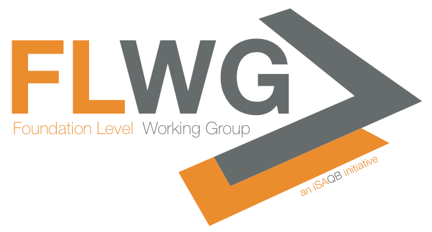

= https://isaqb.org[iSAQB] Foundation Level Curriculum
:toc:
:toc-placement!:

ifdef::env-github[]
:tip-caption: :bulb:
:note-caption: :information_source:
:important-caption: :heavy_exclamation_mark:
:caution-caption: :fire:
:warning-caption: :warning:
endif::[]

== Status

*Release Candidate RC-1* version: image:https://travis-ci.org/isaqb-org/curriculum-foundation.svg?branch=master["Build Status", link="https://travis-ci.org/isaqb-org/curriculum-foundation"]
image:https://img.shields.io/github/last-commit/isaqb-org/curriculum-foundation/master.svg["Last commit"]
image:https://img.shields.io/github/contributors/isaqb-org/curriculum-foundation.svg["Contributors",link="https://github.com/isaqb-org/curriculum-foundation/graphs/contributors"]
image:https://img.shields.io/github/issues/isaqb-org/curriculum-foundation.svg["Issues",link="https://github.com/isaqb-org/curriculum-foundation/issues"]
image:https://img.shields.io/github/issues-closed/isaqb-org/curriculum-foundation.svg["Issues closed",link="https://github.com/isaqb-org/curriculum-foundation/issues?utf8=%E2%9C%93&q=is%3Aissue+is%3Aclosed+"]

This repository contains the *curriculum* for the upcoming version 5 of CPSA-F (which is scheduled for productive use not before July 2019). 

This is <<copyrighted,copyrighted work>>.

== Contents
toc::[]

== What's CPSA-Foundation?
Licensed trainings for _Certified Professional for Software Architecture – Foundation Level (CPSA-F)_ will provide participants with the knowledge and skills required to design, specify and document a software architecture adequate to fulfil the respective requirements for small and medium-sized systems. 

== How to contribute or participate
You found a bug in one of the published versions, have remarks, comments or proposals?

TODO: add issue templates for bugs, comments, proposals

== How to build the documents

Prerequisite: You need a Java Runtime(tm) installed.

You build the output documents with gradle. That will produce both pdf and html output in German (DE) _and_ English (EN), unless you modify the configuration. 

In case you want to change that, adjust the following part of `build.gradle`:

[source,groovy]
----
task buildDocs {
	group 'Documentation'
	description 'Grouping task for generating all languages in several formats'
  dependsOn "renderNoRemarksDE", "renderNoRemarksEN", "renderWithRemarksDE_EN"
}
----

In the "renderNoRemarksDE" certain attributes (aka variables) are defined that configure the corresponding output. 

Please note: You need to include the submodule "pdf-theme" in your checkout, otherwise the build will fail. You can do that with the following command:

[source,bash]
----
git submodule update --recursive --remote
----

=== Legacy build

There is a Docker-based build available in https://github.com/isaqb-org/adoc2pdf[its own repository], in case you cannot build with gradle. 

== Maintainers

The iSAQB members association regularly elects the *Foundation Level Working Group* (FLWG), consisting of maximum 10 people.
The FLWG is responsible for maintaining the CPSA-F Curriculum. Major version updates are reviewed and discussed with board and the members association prior to publication.

The current (2019) FLWG members are:

* Mahbouba Gharbi
* Dr. Carola Lilienthal
* Dr. Ulrich Becker
* Phillip Ghadir (FLWG co-chair)
* Peter Götz (aka _hero of the build_!)
* Dr. Peter Hruschka
* Dr. Alexander Lorz
* Roger Rhoades
* Mischa Soujon
* Dr. Gernot Starke (FLWG chair)

== What does "Foundation Level" cover?

As stated above, _Foundation Level_ covers small to medium-sized software systems.

Based upon their individual practical experience and existing skills, participants will learn to derive architectural decisions from an existing system vision and adequately detailed requirements. 
CPSA-F trainings teach methods and principles for design, communication, documentation and evaluation of software architectures, independent of specific development processes.

Focus is education and training of the following skills:

* Discuss and reconcile fundamental architectural decisions with stakeholders from requirements, management, development, operations and test,
* understand the essential activities of software architecture, and carry out those for small- to medium sized systems,
* document and communicate software architectures based upon architectural views, architecture patterns and technical concepts

In addition, such trainings cover

* the tasks and responsibilities of software architect
* the term software architecture and its meaning
* the roles of software architects within development
* state-of-the-art methods and techniques for developing software architectures

== Contributors
Work on this curriculum started way back in 2007/2008 - and numerous people contributed - either by proposing, crafting and writing content or by commenting, reviewing and otherwise helping to improve.

(alphabetical order, current FLWG members excluded)

Wolfgang Fahl, Prof. Dieter Jungmann, Prof. Arne Koschel, Prof. Andreas Rausch, Bettina Tacke, Holger Tiemeyer

[[copyrighted]]
== Licensing and Copyright

[IMPORTANT]
====
THIS IS COPYRIGHTED WORK.

© (Copyright), https://isaqb.org[International Software Architecture Qualification Board e. V.]
(iSAQB^(R)^ e. V.) 2009-2019
====

The curriculum may only be used subject to the following conditions:

1. You wish to obtain the CPSA Certified Professional for Software Architecture Foundation Level^(R)^ certificate. For the purpose of obtaining the certificate, it shall be permitted to use these text documents and/or curricula by creating working copies for your own computer. If any other use of documents and/or curricula is intended, for instance for their dissemination to third parties, for advertising etc., please write to contact@isaqb.org to enquire whether this is permitted. A separate license agreement would then have to be entered into.

2. If you are a trainer, training provider or training organizer, it shall be possible for you to use the documents and/or curricula once you have obtained a usage license.
Please address any enquiries to contact@isaqb.org. License agreements with comprehensive provisions for all aspects exist.

3. If you fall neither into category 1 nor category 2, but would like to use these documents and/or curricula nonetheless, please also contact the iSAQB e. V. by writing to contact@isaqb.org. You will then be informed about the possibility of acquiring relevant licenses through existing license agreements, allowing you to obtain your desired usage authorizations.

We stress that, as a matter of principle, this curriculum is protected by copyright.

The International Software Architecture Qualification Board e. V. (iSAQB^(R)^ e. V.) has exclusive entitlement to these copyrights.

The abbreviation "e. V." is part of the iSAQB's official name and stands for "eingetragener Verein" (registered association), which describes its status as a legal entity according to German law.
 
